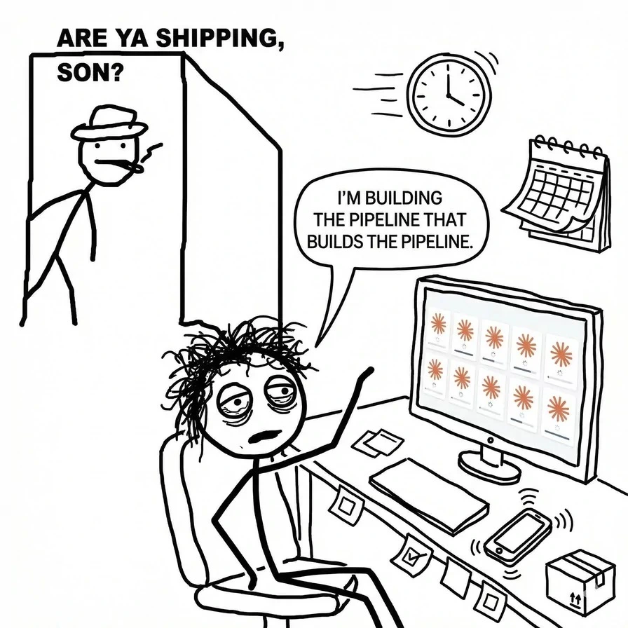

# OpenKit

OpenKit provides developers with a simple, centralized way to manage their agents and control how they operate across different projects.

Rather than enforcing a predefined workflow structure, OpenKit gives you the flexibility to design your own.

You can experiment, analyze the results, and continuously refine your approach until it works exactly the way you need. We believe this flexibility is the true strength of OpenKit—especially in a landscape where AI best practices are evolving so quickly.

Check the official [docs](https://openkit.work/) for more info and usage patterns.

<br />

⚠️ <b>This project is in an early stage, so expect bugs and be cautious!</b>

<br /><br />

## 🏗 Setup

> [!TIP]
> The easiest way to set up OpenKit is to [download](https://www.openkit.work/) the app and follow the instructions.
>
> You will be up and running in no time. 👍

<br />

Alternatively, you can clone the repo and set it up locally:

### Prerequisites:

- Node.js >= 18 (LTS recommended)
- pnpm == 10.30.1
- Zig >= 0.15
- Go >= 1.21
- TinyGo >= 0.30
- Homebrew (optional, for automatic dependency installation on macOS)

<br />

**1. Run the setup script**

This checks for all required dependencies (offering to install any missing ones via Homebrew), enables Corepack for pnpm, creates `.env.local` from `.env.example`, and installs pnpm dependencies:

```bash
$ pnpm run setup
# or
$ npm run setup
# or
$ bash scripts/setup.sh
```

<br />

**2. Build once (recommended for first run)**

```bash
$ pnpm build
```

<br /><br />

## 🏃🏻‍♂️ Run the app

Run all first-class apps:

```bash
$ pnpm dev
```

Run specific apps:

```bash
$ pnpm dev:cli
$ pnpm dev:server
$ pnpm dev:desktop-app
$ pnpm dev:mobile-app
$ pnpm dev:web-app
$ pnpm dev:website
```

<br /><br />

## ⚙️ Build

```bash
$ pnpm build
$ pnpm build:cli
$ pnpm build:server
$ pnpm build:web-app
$ pnpm build:desktop-app
$ pnpm build:website
$ pnpm build:mobile-app
```

Environment variables:

- `OPENKIT_SERVER_PORT` (default `6969`) — backend server base port
- `OPENKIT_WEB_APP_PORT` (default `5173`) — web-app Vite dev server port

<br /><br />

## 📦 Package

```bash
$ pnpm package
$ pnpm package:mac
$ pnpm package:linux # work in progress
```

<br /><br />

## 🚀 Deploy

Everything is released from `master`.

- On pull requests targeting `master`, CI runs code quality, type checks, smoke and unit tests, and build jobs with affected-target guards.
- On push/merge to `master`, the release workflow creates the release commit/tag and GitHub release if `desktop-app` (or its packaging dependencies) is affected.
- A dedicated package workflow runs on release tag pushes and attaches macOS/Linux artifacts to that tag.

<br /><br />

## 📚 Docs

- [API Reference](docs/API.md)
- [Agents](docs/AGENTS.md)
- [Architecture](docs/ARCHITECTURE.md)
- [CLI Reference](docs/CLI.md)
- [Configuration](docs/CONFIGURATION.md)
- [Development](docs/DEVELOPMENT.md)
- [Electron](docs/ELECTRON.md)
- [Frontend](docs/FRONTEND.md)
- [Hooks](docs/HOOKS.md)
- [Integrations](docs/INTEGRATIONS.md)
- [MCP](docs/MCP.md)
- [Notifications](docs/NOTIFICATIONS.md)
- [Port Mapping](docs/PORT-MAPPING.md)
- [Project Structure](docs/PROJECT_STRUCTURE.md)
- [Setup Flow](docs/SETUP-FLOW.md)

<br /><br />

## ❤️ Contributions

Not yet, we are still figuring things out for ourselves.


