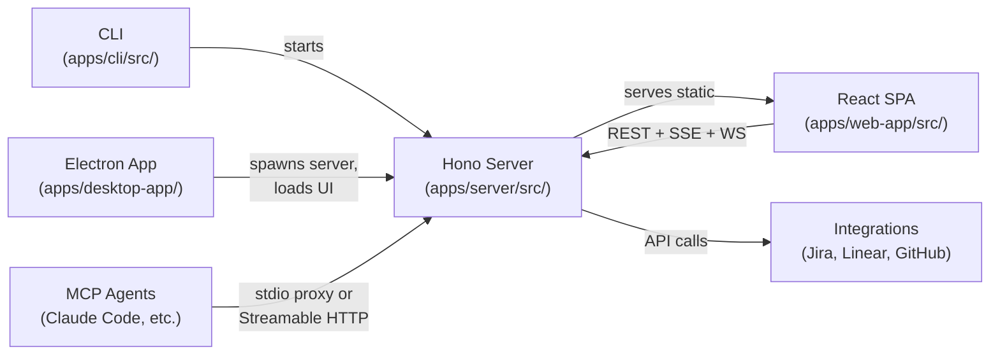
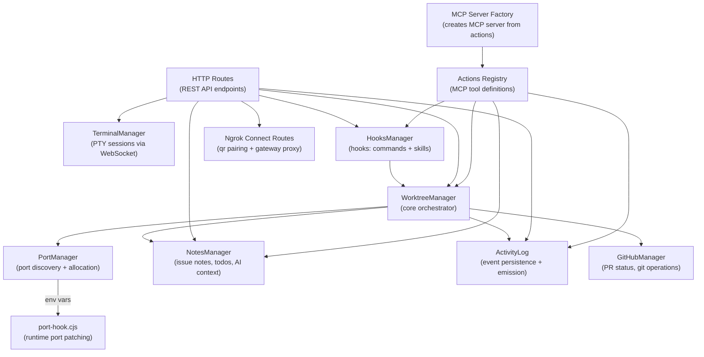
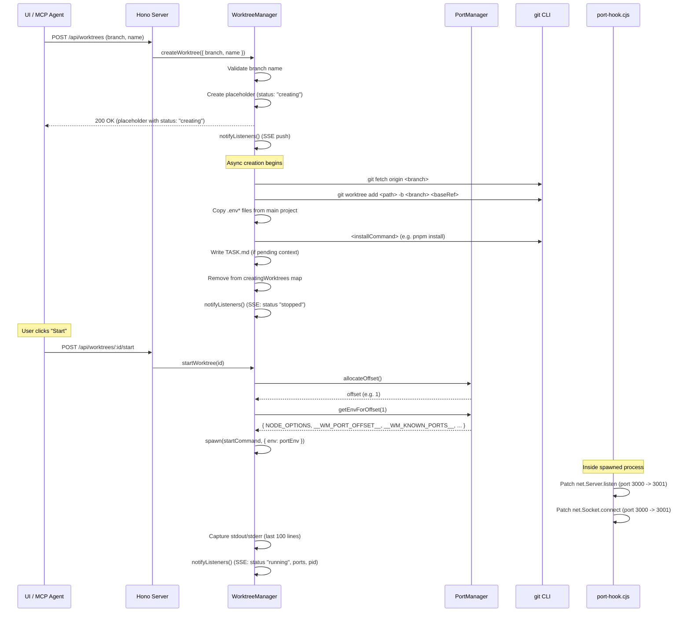

# Architecture Overview

## System Overview

OpenKit is a CLI tool, web UI, and optional Electron desktop app for managing multiple git worktrees with automatic port offsetting. It solves the problem of port conflicts when running multiple dev server instances concurrently by monkey-patching Node.js `net.Server.listen` and `net.Socket.connect` at runtime via `--require`.

The system is organized into three primary layers:

1. **CLI** -- The entry point. Routes subcommands (`init`, `mcp`, `task`, `add`, `activity`), starts the HTTP server, and opens the UI in Electron or a browser.
2. **Server** -- A Hono-based HTTP server that exposes a REST API, SSE event streams, WebSocket terminals, and a Streamable HTTP MCP transport. All state is managed here.
3. **Clients** -- The React SPA (web UI), the Electron shell, and MCP agents (e.g. Claude Code) all connect to the same server instance.

## System Layers



The CLI starts the Hono server, which then serves the React SPA as static files. The Electron app spawns a separate server process per project and loads the UI in a BrowserWindow. MCP agents connect either through stdio (proxy mode relaying to the running server) or directly via Streamable HTTP transport at `/mcp`.

## Core Components



### WorktreeManager

`apps/server/src/manager.ts` -- The central orchestrator. Manages the lifecycle of git worktrees: creation (with async status updates via SSE), starting/stopping dev processes, removal, and renaming. It owns instances of `PortManager` and `NotesManager`, and optionally initializes `GitHubManager` for PR tracking and git operations.

Key responsibilities:

- **Worktree CRUD**: `createWorktree()`, `removeWorktree()`, `renameWorktree()`, `recoverWorktree()`
- **Process management**: `startWorktree()` spawns the dev command with port-offset env vars; `stopWorktree()` sends SIGTERM
- **SSE notification**: Maintains a set of event listeners and calls `notifyListeners()` on every state change
- **Issue integration**: `createWorktreeFromJira()` and `createWorktreeFromLinear()` fetch issue data, generate a branch name, write `TASK.md`, and link the issue to the worktree
- **Config management**: `reloadConfig()`, `updateConfig()`, `getConfig()`
- **Log capture**: Stdout/stderr from spawned processes is captured (last 100 lines) and forwarded to listeners with debounced batching (250ms)
- **Activity tracking**: Owns an `ActivityLog` instance, emitting lifecycle events (`creation_started`, `creation_completed`, `creation_failed`, `started`, `stopped`, `crashed`) during worktree operations

### PortManager

`apps/server/src/port-manager.ts` -- Handles port discovery, offset allocation, and environment variable generation.

Key responsibilities:

- **Port discovery**: `discoverPorts()` spawns the project's start command, waits for stabilization (15 seconds), walks the process tree via `pgrep`, and scans for listening ports via `lsof`
- **Offset allocation**: `allocateOffset()` hands out sequential multiples of `offsetStep` (e.g., 1, 2, 3...); `releaseOffset()` frees them
- **Env var generation**: `getEnvForOffset()` builds the environment variables that activate the port hook: `NODE_OPTIONS` (with `--require port-hook.cjs`), `__WM_PORT_OFFSET__`, `__WM_KNOWN_PORTS__`, plus any user-defined `envMapping` templates
- **Env mapping detection**: `detectEnvMapping()` scans `.env*` files for references to discovered ports and generates template strings like `http://localhost:${3000}`
- **Persistence**: Discovered ports and env mappings are written back to `.openkit/config.json`

### TerminalManager

`apps/server/src/terminal-manager.ts` -- Manages interactive PTY (pseudo-terminal) sessions that connect to the web UI via WebSockets.

Key responsibilities:

- **Session lifecycle**: `createSession()` registers a session; `attachWebSocket()` spawns the PTY process (using `node-pty`) and wires bidirectional data flow between the WebSocket and the PTY
- **Resize handling**: JSON messages with `{ type: "resize", cols, rows }` are intercepted and forwarded to `pty.resize()`
- **Cleanup**: `destroySession()`, `destroyAllForWorktree()`, `destroyAll()` handle teardown of PTY processes and WebSocket connections

### NotesManager

`apps/server/src/notes-manager.ts` -- Manages per-issue metadata stored as JSON files under `.openkit/issues/{source}/{issueId}/notes.json`.

Stored data per issue:

- **linkedWorktreeId**: Which worktree is associated with this issue
- **personal**: Free-text notes (private to the user, not exposed to agents)
- **aiContext**: Directions for AI agents working on this issue
- **todos**: A checklist of sub-tasks with `id`, `text`, `checked`, and `createdAt`
- **gitPolicy**: Per-issue overrides for agent git permissions (`agentCommits`, `agentPushes`, `agentPRs`)

The `buildWorktreeLinkMap()` method scans all notes files to produce a reverse map from worktree IDs to their linked issues -- used by `WorktreeManager.getWorktrees()` to enrich worktree info with issue metadata.

### ActivityLog

`apps/server/src/activity-log.ts` -- Persists and broadcasts activity events (agent actions, worktree lifecycle, git operations) to SSE listeners.

Key responsibilities:

- **Event persistence**: Events are appended to `.openkit/activity.jsonl` in JSONL format (one JSON object per line)
- **Real-time broadcast**: Maintains a set of subscriber callbacks, notified on every new event
- **Querying**: `getEvents(filter?)` supports filtering by category, timestamp, and limit
- **Pruning**: Removes events older than the configured retention period (default 7 days), runs on startup and every hour
- **Notification classification**: `isToastEvent()` and `isOsNotificationEvent()` expose config-based checks in `ActivityLog`; product policy routes workflow/agent/live updates to the Activity feed, reserves toasts for direct user actions, and reserves Electron native alerts for agent-attention events

Shared activity types are defined in `libs/shared/src/activity-event.ts`: `ActivityCategory` (`agent` | `worktree` | `system`), `ActivitySeverity` (`info` | `success` | `warning` | `error`), `ActivityEvent`, and the `ACTIVITY_TYPES` event catalog.

### HooksManager

`apps/server/src/verification-manager.ts` -- Manages automated checks and agent skills organized by trigger type. Contains two item types:

1. **Command steps**: Shell commands (lint, typecheck, build) that run in the worktree directory. Each step has a trigger type, can be enabled/disabled, and custom-trigger steps include a natural-language condition.
2. **Skill references**: References to skills from the `~/.openkit/skills/` registry. The same skill can be used in multiple trigger types (identified by `skillName + trigger` composite key). Skills support per-issue overrides (inherit/enable/disable).

Six trigger types: `pre-implementation` (before agent work), `post-implementation` (after agent work), `custom` (agent decides based on condition), `on-demand` (manually triggered), `worktree-created` (auto-run after worktree creation), and `worktree-removed` (auto-run after worktree removal). Lifecycle triggers are command-only.

Command step runs are persisted to `.openkit/worktrees/{id}/hooks/latest-run.json`. Skill results reported by agents are stored at `.openkit/worktrees/{id}/hooks/skill-results.json`.

Hooks are configured via `.openkit/hooks.json` with `steps` and `skills` arrays.

### Ngrok Connect Routes

`apps/server/src/routes/ngrok-connect.ts` implements the experimental remote gateway flow:

- Tunnel lifecycle endpoints (`/api/ngrok/tunnel/enable`, `/api/ngrok/tunnel/disable`, `/api/ngrok/status`)
- QR pairing endpoints (`/api/ngrok/pairing/start`, `/api/ngrok/pairing/exchange`, `/_ok/pair`)
- Authenticated gateway proxy (`/_ok/p/:projectId/*`) that forwards allowlisted internal routes (`/api/*`, `/mcp`)

## Data Flow

### 1. Worktree Creation, Port Allocation, and Process Spawn



The creation is asynchronous -- the HTTP response returns immediately with a placeholder entry (status `"creating"`) so the UI can show progress. The actual `git worktree add`, dependency installation, and `TASK.md` generation happen in the background, with status updates pushed via SSE.

### 2. MCP Tool Calls

MCP agents communicate with OpenKit through two modes:

**Proxy mode** (preferred when the server is running): The `openkit mcp` command detects a running server via `.openkit/server.json`, then relays JSON-RPC messages between stdio (connected to Claude Code) and the server's Streamable HTTP transport at `/mcp`. This ensures the agent shares state with the UI.

**Standalone mode** (fallback): If no server is running, `openkit mcp` creates its own `WorktreeManager` instance and serves MCP tools directly over stdio.

The tool definitions live in `libs/agent/src/actions.ts` as a flat array of `Action` objects. Each action has a name, description, parameter schema, and async handler function. The `MCP Server Factory` (`apps/server/src/mcp-server-factory.ts`) converts these into MCP tools with Zod schemas. The same actions are used for both the Streamable HTTP MCP transport (exposed at `/mcp` on the server) and the standalone stdio MCP server.

### 3. Terminal Sessions

Terminal sessions use a two-step protocol:

1. **Create session**: `POST /api/worktrees/:id/terminal` returns a `sessionId`
2. **Attach WebSocket**: `GET /api/terminal/:sessionId/ws` upgrades to WebSocket

Once attached, the `TerminalManager` spawns a PTY process (`node-pty`) in the worktree directory. Data flows bidirectionally: keystrokes from the WebSocket are written to the PTY; PTY output is sent back over the WebSocket. Resize messages (`{ type: "resize", cols, rows }`) are intercepted and forwarded to `pty.resize()`.

### 4. Ngrok Connect Mobile Routing

1. Laptop user enables the tunnel from the bottom-right Wi-Fi button (Electron tab bar), then creates a one-time pairing session (`/api/ngrok/pairing/start`).
2. Mobile scans QR and opens `/_ok/pair?token=...` on that ngrok host.
3. `/_ok/pair` validates token (single-use, short TTL), sets `ok_session`, and redirects.
4. Programmatic clients call `/_ok/p/:projectId/...` (or `/mcp` through that prefix); gateway validates session and project, then proxies to internal OpenKit routes.

## Build System

OpenKit uses a dual build system to produce the backend and frontend artifacts:

### Workspace orchestration: Nx

Nx provides project graph orchestration and cached task execution across the repository. Project definitions are colocated with each app (`project.json`), including `web-app`, `cli`, `server`, `desktop-app`, `website`, and `mobile-app`. Nx orchestrates app-local scripts rather than owning app build commands itself.

### Backend: tsup (ESM)

Configuration lives in `apps/cli/tsup.config.ts`:

```typescript
export default defineConfig({
  entry: {
    "cli/index": "src/index.ts",
    "electron-entry": "src/electron-entry.ts",
  },
  outDir: "dist",
  format: "esm",
  external: ["node-pty", "electron", "ws"],
  esbuildOptions(options) {
    options.loader = { ...options.loader, ".md": "text" };
  },
});
```

This bundles two entry points:

- `apps/cli/src/index.ts` -- The CLI entry point (produces `apps/cli/dist/cli/index.js`)
- `apps/cli/src/electron-entry.ts` -- The Electron IPC bridge export entry point

Both are output as ESM. `node-pty` and `electron` are externalized since they contain native bindings that cannot be bundled.

The `.md` text loader inlines markdown files as strings at build time. This is used by the `libs/instructions/src/` directory to keep agent instruction text in standalone `.md` files rather than embedded template literals. See the [Instructions section](#agent-instructions) below.

### Frontend: Vite (React SPA)

```
vite build
```

Vite builds the React SPA through `apps/web-app/vite.config.ts` from `apps/web-app/src/` into `apps/web-app/dist/`. The Hono server serves UI from `apps/web-app/dist` when present, and falls back to downloaded UI components under `~/.openkit/components/web/current` when running in core-only installs. The Electron app loads `apps/web-app/dist/index.html` directly.

### Electron: tsc + electron-builder

The Electron main process (`apps/desktop-app/src/main.ts`) is compiled with `tsc -p apps/desktop-app/tsconfig.json` into `apps/desktop-app/dist/main.js`. The preload script (`apps/desktop-app/src/preload.cjs`) is copied as-is. `electron-builder` packages everything into a macOS `.app` bundle.

### Website: Astro

The marketing website (`apps/website`) builds with Astro to `apps/website/dist/`.

### Mobile: Expo export

The Expo app (`apps/mobile-app`) exports platform bundles to `apps/mobile-app/dist/ios/` and `apps/mobile-app/dist/android/`.

### Runtime artifact: port-hook.cjs

`apps/server/src/runtime/port-hook.cjs` is a pure CommonJS file with zero dependencies. It is copied verbatim to `apps/server/dist/runtime/port-hook.cjs` during the build. It cannot be bundled because it must be loadable via Node's `--require` flag in any process.

### Full build pipeline

```
pnpm build
```

This runs `nx run-many -t build --projects cli,server,web-app,desktop-app,website,mobile-app`.

Build outputs are intentionally split:

1. Core runtime outputs:
   - `cli` -> `apps/cli/dist/`
   - `server` runtime hook -> `apps/server/dist/runtime/`
   - `web-app` -> `apps/web-app/dist/`
   - `desktop-app` -> `apps/desktop-app/dist/`
2. Standalone apps own their output directories:
   - `website` -> `apps/website/dist/`
   - `mobile-app` -> `apps/mobile-app/dist/`

## Directory Structure

For the canonical repository tree, see [PROJECT_STRUCTURE.md](./PROJECT_STRUCTURE.md).

Architecture-level discussion in this document focuses on responsibilities and runtime interactions (not file-by-file inventory).

## Agent Instructions

Agent instruction text (MCP instructions, IDE skill/rule files, hook skill definitions) lives in `libs/instructions/src/` as standalone `.md` files. The tsup esbuild text loader (`{ '.md': 'text' }`) inlines them as strings at build time.

### How it works

1. Each instruction is a `.md` file under `libs/instructions/src/` (or subdirectories `mcp/`, `skills/`)
2. `libs/instructions/src/index.ts` imports all `.md` files, resolves placeholders, and exports typed constants
3. Consumer files (`actions.ts`, `mcp-server-factory.ts`, `builtin-instructions.ts`, `verification-skills.ts`) import from the barrel
4. `md.d.ts` provides TypeScript declarations for `*.md` imports

### Placeholders

| Placeholder    | Resolved                          | Value                               |
| -------------- | --------------------------------- | ----------------------------------- |
| `{{APP_NAME}}` | At module load time in `index.ts` | `APP_NAME` constant ("OpenKit")     |
| `{{WORKFLOW}}` | At module load time in `index.ts` | Content of `mcp/instructions.md`    |
| `{{ISSUE_ID}}` | At runtime by the caller          | Function argument (e.g. "PROJ-123") |

### File map

| File                      | Export                    | Used by                                                                           |
| ------------------------- | ------------------------- | --------------------------------------------------------------------------------- |
| `mcp/mcp-server.md`       | `MCP_INSTRUCTIONS`        | `mcp-server-factory.ts` (server instructions)                                     |
| `mcp/mcp-work-on-task.md` | `MCP_WORK_ON_TASK_PROMPT` | `mcp-server-factory.ts` (prompt template)                                         |
| `mcp/claude-skill.md`     | `CLAUDE_SKILL`            | `builtin-instructions.ts` (deployed to `~/.claude/skills/`)                       |
| `mcp/cursor-rule.md`      | `CURSOR_RULE`             | `builtin-instructions.ts` (deployed to `.cursor/rules/`)                          |
| `mcp/vscode-prompt.md`    | `VSCODE_PROMPT`           | `builtin-instructions.ts` (deployed to `.github/prompts/`)                        |
| `mcp/instructions.md`     | _(internal)_              | Interpolated into claude-skill, cursor-rule, and vscode-prompt via `{{WORKFLOW}}` |
| `skills/*/SKILL.md`       | `BUNDLED_SKILLS`          | `verification-skills.ts` (seeded into `~/.openkit/skills/` registry only)         |

## Server-as-Hub Pattern

The Hono server acts as a central hub. All clients -- the React SPA, the Electron shell, and MCP agents -- connect to the same server instance and share the same state.

The server writes a `server.json` file to `.openkit/server.json` on startup:

```json
{
  "url": "http://localhost:6969",
  "pid": 12345
}
```

This file enables **agent discovery**: when `openkit mcp` starts, it reads `server.json`, checks if the process is alive (via `process.kill(pid, 0)`), and if so, enters **proxy mode** -- relaying JSON-RPC messages between stdio and the server's `/mcp` endpoint. This means an MCP agent and the web UI always see the same worktree state, running processes, and logs.

If no server is running (e.g., the agent is invoked before the user starts the UI), `openkit mcp` falls back to **standalone mode** with its own `WorktreeManager`.

The Electron app uses a similar pattern: `apps/desktop-app/src/server-spawner.ts` spawns a `OpenKit` CLI process per project (with `--no-open` to suppress browser opening), polls until the server is ready, then loads the UI at the server URL. The `apps/desktop-app/src/project-manager.ts` handles multi-project tabs, each backed by its own server process.

`server.json` is cleaned up on graceful shutdown (SIGINT/SIGTERM).

## Configuration Discovery

Configuration is loaded from `.openkit/config.json`. The config loader walks up the directory tree from `process.cwd()` looking for a `.openkit/` directory containing `config.json`. This allows running `OpenKit` from any subdirectory within a project.

For full details on configuration options and format, see [CONFIGURATION.md](./CONFIGURATION.md).
